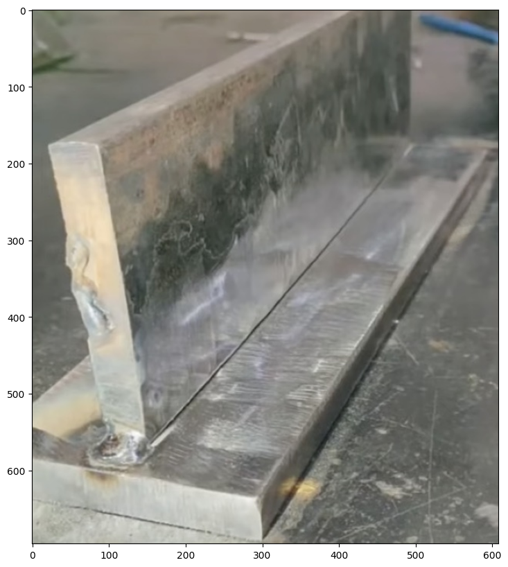
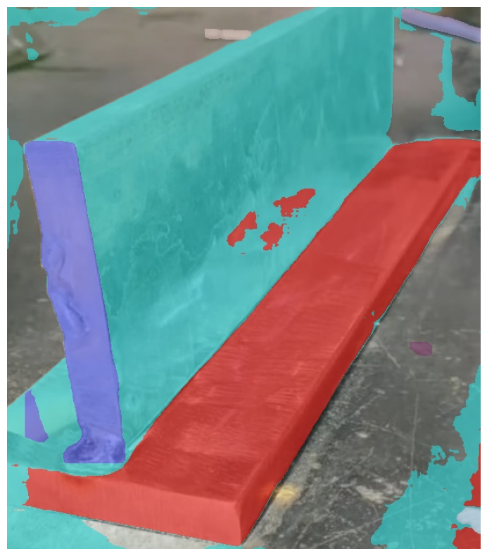
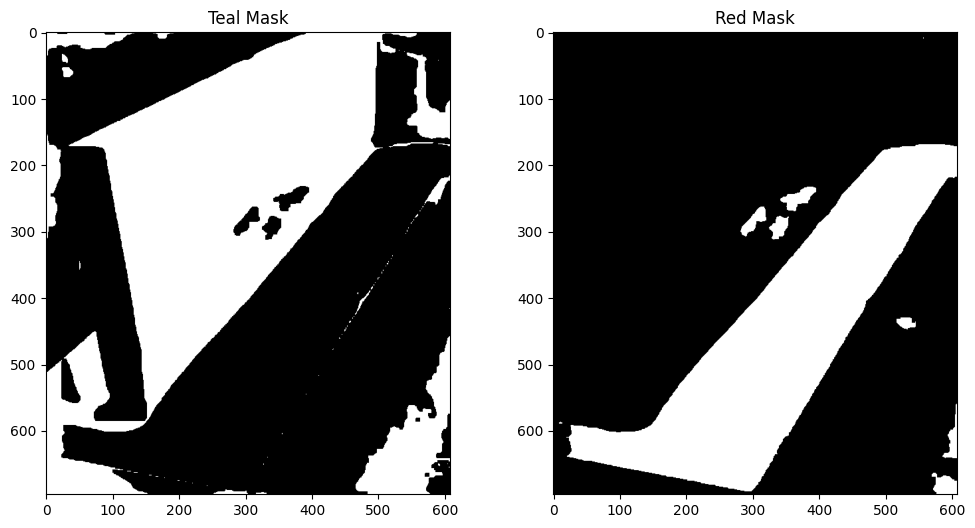
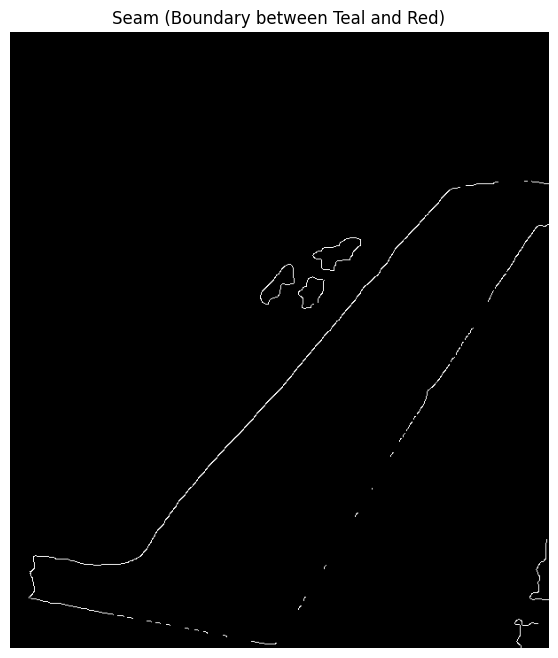
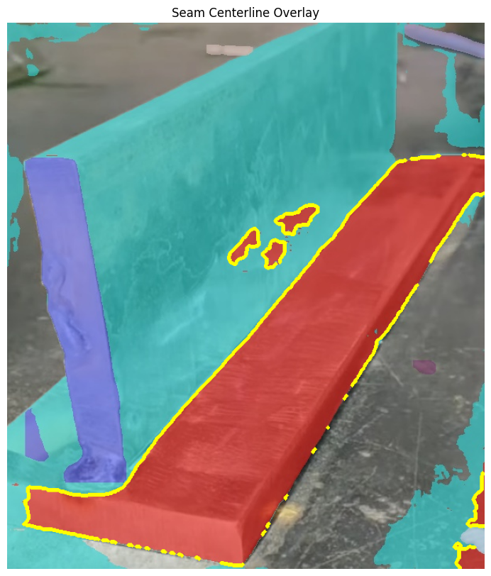

# Weld Seam Finding

## Real-time fine-tuned seam finding
Starting with adapting a 2D model for 3D before going full 3D.  I started with FastSAM as a baseline, since it claims to be 50x faster than SAM.  It's based on YOLOv8-seg.  Some alternatives include YOLOv8-seg, YOLOv9-seg, YOLACT++, U-Net, BiSeNet.

This is a basic implementation but gives an idea of the segmentation and seam extraction workflow.  

Next steps:
* Make more robust to different color masks
* Will need to make this more robust to different camera poses and angles in case we can't assume a 2D plane
* Optimization to get this to process to process real-time video
  * Optimize the image and video input before even running it through inference, downsample input sizes
  * Parallelize the processing and inference, and use same memory space
  * Optimize runtime/engine
  * Optimize inference: segmentation architecture-specific optimizations (sliding window, segment every N-th frame and interpolate in between).  Can't quantize and prune w/out the original training data, though, but maybe post-training quantization.  
  * Use more efficient path memory techniques to remember the path over time and lessen the need to do full segmentation every frame (Kalman filter to predict next position, interpolate path using motion estimation, etc)
* Explore what sensors we want to add to add depth
  
## Autonomous Programming Workflow
### Image processing pipeline
* Capture image/video and geometry
* Pre-process (normalize lighting, remove noise)
* Segment the objects
* Extract boundary line
* Convert to 3D coordinates
* Generate trajectory

### Path optimization
Focuses on the WHAT and WHEN, figure out where the robot arm needs to move/go
* Layer sequence plan
* Robot kinematic constraints
* Welding process constraints
* Workspace boundaries
* Convert layer plans to waypoints
* Generate 

### Robot motion planning
Focuses on the HOW, figure out what it takes for the robot arm to move there
* Inverse dynamics/kinematics solver